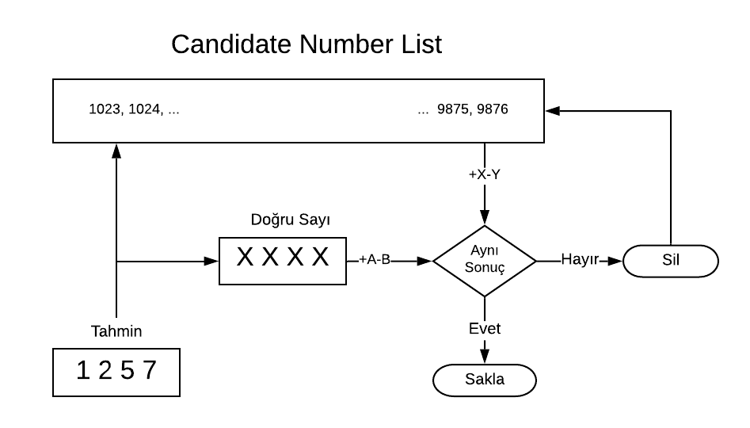
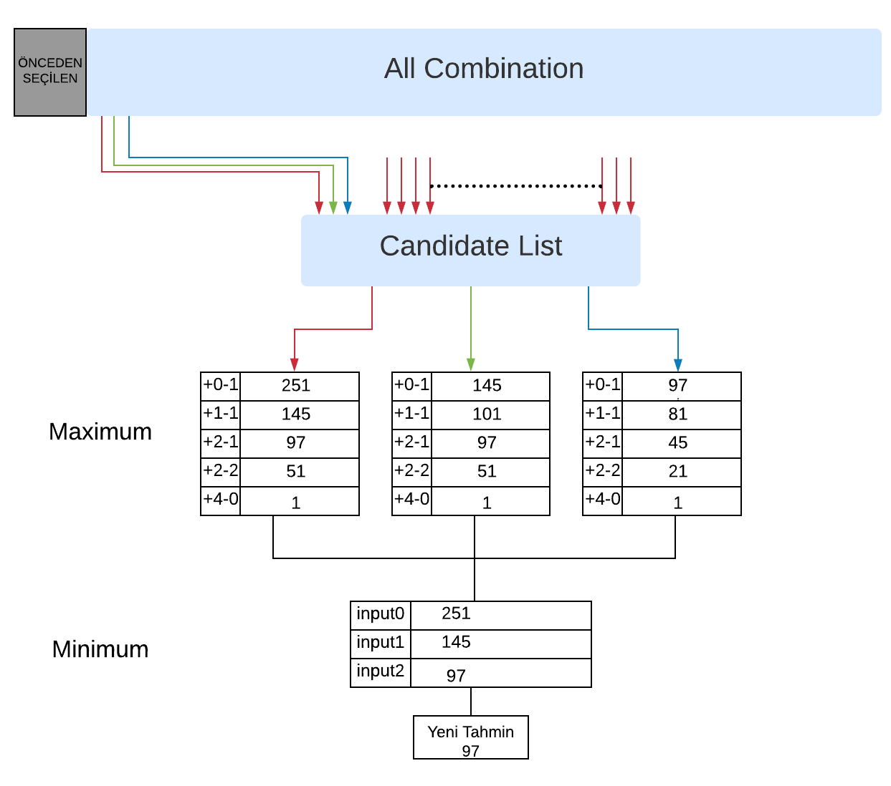

# NumberGuessing

### Kullanım

1. Repository kopyalayın
```bash
git clone https://github.com/
```

2. Build & Run
```bash
cd NumberGuessing
g++ -o outputFileName main.cpp helper.cpp
outputFileName.exe
```


### Algoritmanın temel adımları:

* Yazılımın için rasgele 4 basamaklı bir kod ve tahmin oluştur.

* Muhtemel bütün sayıları içeren bir lister oluştur. `combinations ve candidate_solution` (1023,1024 ... 9875,9876).

<br>

1. Kullanıcıdan bir tahmin al ve kontrol et.

   * Eğer ipuçu "+4-0" ise kullanıcı kazanır.

2. Yazılım tahminde bulunur ve tahmin sayısını `combinations - candidate_solution` listelerinden siler.

3. Kullanıcı tahmine karşılık bir ipuçu girer.

   * Eğer İpuçu "+4-0" ise yazılım kazanır.

4. Yazılım bu ipuçua göre `candidate_solution` listesinden eleme işlemi yapar. Eleme işlemi şu şekilde çalışır:<br>

`candidate_solution` listesi içerisinde bulunan  bir sayı, tahmin sayısı ile karşılaştırıldığında kullanıcının verdiği ipucu ile aynı sonucu vermelidir.
Eğer aynı sonucu vermiyor ise aradığımız sayı olma ihtimali yoktur ve `candidate_solution` listesinden silinir.

<p align="center">
  
</p>

```C++
    // candidate_solution icerisinde ayni karsiligi vermeyenleri listeden siler
    pruneCodes(candidate_solution, current_guess, user_hint);
```

5. Bir sonraki tahmin sayısını hesapla. Bu sayı seçilirken öncelik, seçilen sayının bir sonraki adımda maximum eleme işlemi yapmasıdır.
`combination` listesindeki inputlar teker teker `candidate_solution` ile karşılaştırılıp eleme sayilari bulunur.
Bir input candidate listesindeki bütün değerler ile karşılaştırılır ve oluşan ipuçları bir map üzerisinde tutulur

##### Örnek Map

| İpucu  | Tekrar Sayısı|
| ------------ | ---- |
| +1-0 | 251 | 
| +2-0 | 123 | 
| +0-2 | 41 | 
| +1-3 | 10 |
| +4-0 | 1 |


Bu taplo bize eğer bir sayı seçilirse en fazla kaç tane sayıyı tutacağını gösterir. Tablodaki her bir ipucu bir grup olarak düşünülebilir.
Kullanıcı bize bu gruplardan bir tanesini verecek ve biz bu grupların her biri için eğer bu ipucu gelirse aynı ipucunu elde edebileceğimiz aday sayıların adedini görüyoruz.
Kullanıcının vereceği ipucuna göre bir sonraki adıma bu gruplardan sadece bir tanesi kalacak, diğer gruplar elenecek.<br>
<p align="center">
  
</p>

```C++

    //Minmax skorları hesaplar
    next_guesses = minmax(turn);

    // Bir sonraki tahmini belirler
    current_guess = getNextGuess(next_guesses);
```

Bu gruplar arasından en fazla tekrar edeni seçiyoruz. Bunun sebebi, minimum değerlerin bütün input değerleri için nerdeyse aynı olması.
Daha sonra bu maximum değerler arasından en düşük olanı seçiyoruz.<br>

Kısaca, direkt olarak en çok eleme yapanı alamadığımız için en az eleme ihtimalleri arasından en çoğunu alıyoruz. 


6. Döngü 1. adımdan devam eder.


